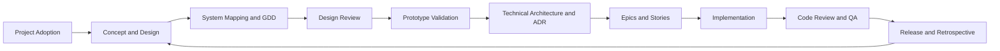

# Game Design Workflow

A modular AI-assisted game development workflow for Codex, covering game concepts, system design, technical architecture, production management, implementation, quality assurance, and release.

The project decomposes complex game development processes into independent Skills. Each Skill defines its use cases, required inputs, execution steps, output artifacts, and quality checks. This allows AI to work with persistent project context instead of acting only as a one-off content generator.

## Goals

- Turn rough ideas into development-ready and testable project artifacts.
- Standardize documents such as GDDs, ADRs, Epics, Stories, and test evidence.
- Maintain traceability between design, architecture, implementation, and testing.
- Apply explicit quality gates before advancing to the next development stage.
- Validate risks through the smallest useful prototype before expanding scope.
- Let AI handle information organization, initial drafts, and consistency checks while the team retains responsibility for key decisions.

## Workflow



A typical artifact traceability chain:

```text
Game Concept
  -> System GDD
  -> Architecture Decision Record
  -> Epic
  -> Story
  -> Code / Config / Asset
  -> Test Evidence
  -> Release
```

## Skill Categories

### Project Adoption and Status Detection

`start` · `adopt` · `onboard` · `project-stage-detect` · `reverse-document` · `help`

Start new projects, adopt existing projects, audit current artifacts, detect development stages, and assemble project context.

### Concept and System Design

`brainstorm` · `art-bible` · `map-systems` · `design-brief-writer` · `design-expert` · `design-system` · `quick-design` · `game-development`

Define the player experience, core loops, system dependencies, art direction, numerical models, and economic rules, then produce design briefs or full GDDs.

### Design Validation and Consistency

`design-review` · `review-all-gdds` · `consistency-check` · `content-audit` · `balance-check` · `scope-check` · `propagate-design-change`

Detect rule conflicts, numerical anomalies, content gaps, scope creep, and downstream impacts caused by design changes.

### Prototyping and User Experience

`prototype` · `html-prototype-designer` · `unity-demo` · `ux-design` · `ux-review` · `playtest-report`

Validate designs through paper, HTML, or Unity prototypes, and define UI, HUD, interaction flows, and playtest feedback.

### Architecture and Production Breakdown

`setup-engine` · `create-architecture` · `architecture-decision` · `architecture-review` · `create-control-manifest` · `create-epics` · `create-stories` · `story-readiness`

Pin the engine environment, document technical decisions, verify architecture coverage, and convert approved designs into executable work.

### Development and Code Quality

`dev-story` · `code-review` · `perf-profile` · `security-audit` · `tech-debt` · `renpy-development`

Implement features from Stories and review code quality, performance, security, and technical debt.

### QA and Test Infrastructure

`test-setup` · `test-helpers` · `qa-plan` · `smoke-check` · `regression-suite` · `test-evidence-review` · `test-flakiness` · `soak-test` · `story-done`

Establish test infrastructure, create QA plans, run quality gates, and verify that Stories satisfy their acceptance criteria.

### Project Management and Release

`estimate` · `sprint-plan` · `sprint-status` · `milestone-review` · `gate-check` · `retrospective` · `changelog` · `patch-notes` · `release-checklist` · `launch-checklist` · `hotfix` · `day-one-patch`

Support estimation, sprint management, milestone reviews, release preparation, emergency fixes, and retrospectives.

### Content Production and Cross-Functional Teams

`asset-spec` · `asset-audit` · `localize` · `bug-report` · `bug-triage` · `team-audio` · `team-combat` · `team-level` · `team-live-ops` · `team-narrative` · `team-polish` · `team-qa` · `team-release` · `team-ui`

Coordinate asset production, localization, defect management, and cross-functional team workflows.

### Skill Maintenance

`skill-test` · `skill-improve`

Validate Skill structure and behavior, then improve Skills through test, fix, and retest cycles.

## Repository Structure

```text
Game_Design/
├─ README.md
└─ skills/
   ├─ brainstorm/
   │  └─ SKILL.md
   ├─ design-system/
   │  └─ SKILL.md
   ├─ game-development/
   │  ├─ SKILL.md
   │  └─ references/
   ├─ create-architecture/
   │  └─ SKILL.md
   ├─ dev-story/
   │  └─ SKILL.md
   └─ ...
```

Each Skill is stored in its own directory and uses `SKILL.md` as its entry point. Some broader Skills also include a `references/` directory containing instructions that are loaded according to the current task type.

## Installation

Clone the repository:

```powershell
git clone https://github.com/Silvera0218/Game_Design.git
cd Game_Design
```

Copy an individual Skill into the Codex Skills directory:

```powershell
Copy-Item -Recurse .\skills\<skill-name> "$env:CODEX_HOME\skills\"
```

Install all Skills:

```powershell
Copy-Item -Recurse .\skills\* "$env:CODEX_HOME\skills\"
```

If `CODEX_HOME` is not configured, copy the Skills into the `skills` directory used by your local Codex installation. Restart or refresh the Codex session after installation.

## Usage

Describe the goal directly or explicitly name the Skill in your request:

```text
Use brainstorm to turn this game idea into a review-ready concept document.
```

```text
Use design-system to write a GDD for the home economy system.
```

```text
Use story-readiness to determine whether this Story is ready for implementation.
```

```text
Use smoke-check to verify whether the current build is ready for QA handoff.
```

When a task spans multiple stages, complete the upstream artifacts and quality checks before moving downstream. For example:

```text
brainstorm
  -> map-systems
  -> design-system
  -> design-review
  -> create-architecture
  -> create-epics
  -> create-stories
  -> story-readiness
  -> dev-story
  -> code-review
  -> smoke-check
  -> story-done
```

## Design Conventions

### Stage Gates

The workflow uses verdicts such as `PASS`, `CONCERNS`, and `FAIL`, or readiness states specific to an individual Skill. A project should not advance past a critical gate until blocking issues have been resolved.

### Document Traceability

Design requirements, architecture decisions, Stories, and test evidence should reference one another through stable identifiers. When an upstream artifact changes, all affected downstream artifacts should be reviewed again.

### Minimum Validated Scope

Prioritize one complete loop that can be played and tested. Prototypes and vertical slices should answer explicit questions instead of accumulating unvalidated features.

### Human Decision-Making

AI output supports design, implementation, and review. It does not replace project owners' final judgment on product direction, balancing, technical risk, content quality, or release decisions.

## Contributing

Contributions that add development stages, templates, engine practices, or test cases are welcome.

Changes should ideally include:

- The problem the Skill solves and its intended use cases.
- Trigger conditions and execution boundaries.
- Required upstream context.
- Explicit output artifacts.
- Verifiable quality criteria.
- At least one standard case and one edge case.

Changes to existing Skills should remain backward compatible where practical and describe their impact on other stages or artifacts.

## Project Status

The workflow is under active development. Current priorities include adding real project examples, improving cross-document traceability, making quality gates more executable, and reducing context drift in long-running projects.
