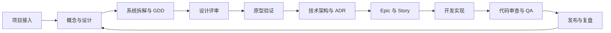

# Game Design Workflow

面向 Codex 的模块化 AI 游戏研发工作流，覆盖游戏概念、系统设计、技术架构、生产管理、功能开发、质量保证与版本发布。

项目将复杂的游戏开发过程拆分为独立 Skill。每个 Skill 都包含明确的适用场景、输入资料、执行步骤、输出产物和质量检查，使 AI 能够在持续读取项目上下文的基础上参与研发，而不只是完成一次性的内容生成。

## 目标

- 将零散创意逐步转化为可开发、可测试的项目产物；
- 统一 GDD、ADR、Epic、Story、测试证据等文档结构；
- 建立设计、架构、实现和测试之间的追溯关系；
- 在进入下一研发阶段前执行明确的质量门禁；
- 优先通过最小原型验证风险，减少范围膨胀与后期返工；
- 让 AI 负责信息整理、初稿生成和一致性检查，由团队负责关键决策。

## 工作流



典型的产物追溯链：

```text
游戏概念
  -> 系统 GDD
  -> 架构决策 ADR
  -> Epic
  -> Story
  -> Code / Config / Asset
  -> Test Evidence
  -> Release
```

## Skill 分类

### 项目接入与状态识别

`start` · `adopt` · `onboard` · `project-stage-detect` · `reverse-document` · `help`

用于新项目启动、旧项目接入、现有产物审核、阶段判断和上下文整理。

### 概念与系统设计

`brainstorm` · `art-bible` · `map-systems` · `design-brief-writer` · `design-expert` · `design-system` · `quick-design` · `game-development`

用于确定玩家体验、核心循环、系统依赖、美术方向、数值与经济规则，并生成设计简报或完整 GDD。

### 设计验证与一致性检查

`design-review` · `review-all-gdds` · `consistency-check` · `content-audit` · `balance-check` · `scope-check` · `propagate-design-change`

用于发现规则冲突、数值异常、内容缺口、范围膨胀，以及设计变更对下游产物的影响。

### 原型与用户体验

`prototype` · `html-prototype-designer` · `unity-demo` · `ux-design` · `ux-review` · `playtest-report`

用于纸面、HTML 或 Unity 原型验证，以及 UI、HUD、交互流程和测试反馈整理。

### 架构与生产拆分

`setup-engine` · `create-architecture` · `architecture-decision` · `architecture-review` · `create-control-manifest` · `create-epics` · `create-stories` · `story-readiness`

用于固定引擎环境、记录技术决策、验证架构覆盖度，并将设计拆分成可执行任务。

### 开发与代码质量

`dev-story` · `code-review` · `perf-profile` · `security-audit` · `tech-debt` · `renpy-development`

用于按 Story 实现功能，检查代码质量、性能、安全与技术债务。

### QA 与测试基础设施

`test-setup` · `test-helpers` · `qa-plan` · `smoke-check` · `regression-suite` · `test-evidence-review` · `test-flakiness` · `soak-test` · `story-done`

用于搭建测试体系、制定 QA 计划、执行质量门禁并验证 Story 完成度。

### 项目管理与版本发布

`estimate` · `sprint-plan` · `sprint-status` · `milestone-review` · `gate-check` · `retrospective` · `changelog` · `patch-notes` · `release-checklist` · `launch-checklist` · `hotfix` · `day-one-patch`

用于估算、冲刺管理、里程碑评审、发布准备、热修复与复盘。

### 内容生产与专项团队

`asset-spec` · `asset-audit` · `localize` · `bug-report` · `bug-triage` · `team-audio` · `team-combat` · `team-level` · `team-live-ops` · `team-narrative` · `team-polish` · `team-qa` · `team-release` · `team-ui`

用于资产、本地化、缺陷管理，以及跨职能团队工作流协调。

### Skill 维护

`skill-test` · `skill-improve`

用于检查 Skill 的结构和行为，并通过测试、修复、复测循环持续迭代。

## 目录结构

```text
Game_Design/
├─ README.md
└─ skills/
   ├─ brainstorm/
   │  └─ SKILL.md
   ├─ design-system/
   │  └─ SKILL.md
   ├─ game-development/
   │  ├─ SKILL.md
   │  └─ references/
   ├─ create-architecture/
   │  └─ SKILL.md
   ├─ dev-story/
   │  └─ SKILL.md
   └─ ...
```

每个 Skill 以独立目录保存，入口文件为 `SKILL.md`。部分综合 Skill 还包含按任务类型加载的 `references/` 参考文件。

## 安装

克隆仓库：

```powershell
git clone https://github.com/Silvera0218/Game_Design.git
cd Game_Design
```

将需要的 Skill 复制到 Codex Skill 目录：

```powershell
Copy-Item -Recurse .\skills\<skill-name> "$env:CODEX_HOME\skills\"
```

安装全部 Skill：

```powershell
Copy-Item -Recurse .\skills\* "$env:CODEX_HOME\skills\"
```

如果没有设置 `CODEX_HOME`，请将 Skill 复制到本机 Codex 使用的 `skills` 目录。安装后重新启动或刷新 Codex 会话。

## 使用

在请求中直接描述目标，或明确指定 Skill：

```text
使用 brainstorm，把这个游戏想法整理成可评审的概念文档。
```

```text
使用 design-system，为家园经济系统编写 GDD。
```

```text
使用 story-readiness，检查这个 Story 是否可以进入开发。
```

```text
使用 smoke-check，验证当前版本是否可以移交 QA。
```

当任务涉及多个阶段时，应先完成上游产物和质量检查，再进入下游阶段。例如：

```text
brainstorm
  -> map-systems
  -> design-system
  -> design-review
  -> create-architecture
  -> create-epics
  -> create-stories
  -> story-readiness
  -> dev-story
  -> code-review
  -> smoke-check
  -> story-done
```

## 设计约定

### 阶段门禁

工作流使用 `PASS`、`CONCERNS`、`FAIL`，或与具体 Skill 对应的就绪状态表示检查结果。未通过关键门禁时，不应直接跳入下一阶段。

### 文档追溯

设计需求、架构决策、Story 和测试证据应使用稳定编号互相引用。上游内容发生变化时，需要重新检查所有受影响的下游产物。

### 最小可验证范围

优先完成一条能够被实际游玩和测试的完整循环。原型与垂直切片应回答明确问题，而不是堆叠尚未验证的功能数量。

### 人工决策

AI 输出是设计、实现与检查的辅助材料，不替代项目负责人对产品方向、数值、技术风险、内容品质和发布结果的最终判断。

## 贡献

欢迎补充新的研发阶段、模板、引擎实践和测试案例。

提交修改时建议包含：

- Skill 解决的问题和适用场景；
- 触发条件与执行边界；
- 必须读取的上游资料；
- 明确的输出产物；
- 可验证的质量标准；
- 至少一个正常案例和一个边界案例。

对现有 Skill 的修改应尽量保持向后兼容，并说明对其他阶段或产物的影响。

## 项目状态

工作流仍在持续迭代。现阶段重点是补充真实项目案例、完善跨文档追溯、提高质量门禁的可执行性，并减少长周期项目中的上下文漂移。
